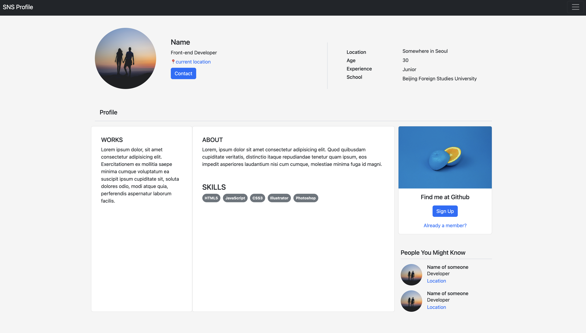
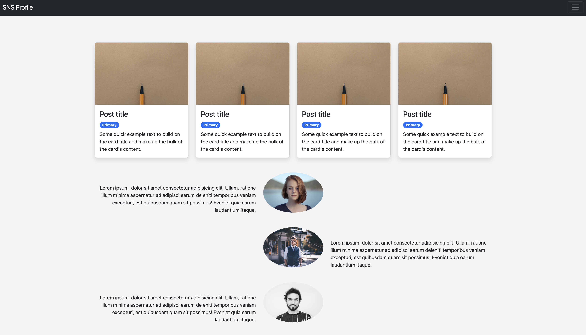

# SNS 프로필 페이지

SNS 프로필 페이지의 사용자의 개인 정보, 작업, 기술, 그리고 게시물을 보여주는 인터페이스 구성 연습을 위한 작업입니다.

## 주요 기능

- **프로필 정보**: 사용자는 자신의 기본 정보(이름, 위치, 연락처 등)를 프로필에 추가할 수 있습니다.

- **작업 포트폴리오**: 사용자는 자신의 작업을 소개하는 섹션을 통해 포트폴리오를 공개할 수 있습니다.

- **기술 소개**: HTML5, JavaScript, CSS3 등의 기술 스택을 아이콘과 함께 보여줍니다.

## 디자인 요소

- **반응형 레이아웃**: 다양한 디바이스에서 일관된 사용자 경험을 제공하기 위해 반응형 디자인을 적용했습니다.

- **모던 UI 컴포넌트**: 사용자의 관심을 끌 수 있는 현대적인 UI 컴포넌트를 사용하여 시각적 매력을 높였습니다.

## 사용 기술

- **HTML5 & CSS3**: 마크업과 스타일링을 위해 최신 웹 표준을 따릅니다.

- **JavaScript**: 동적인 사용자 인터페이스 상호작용을 위한 스크립팅 언어로 사용합니다.

- **Bootstrap**: 일관된 디자인을 위한 프론트엔드 프레임워크로 활용합니다.

